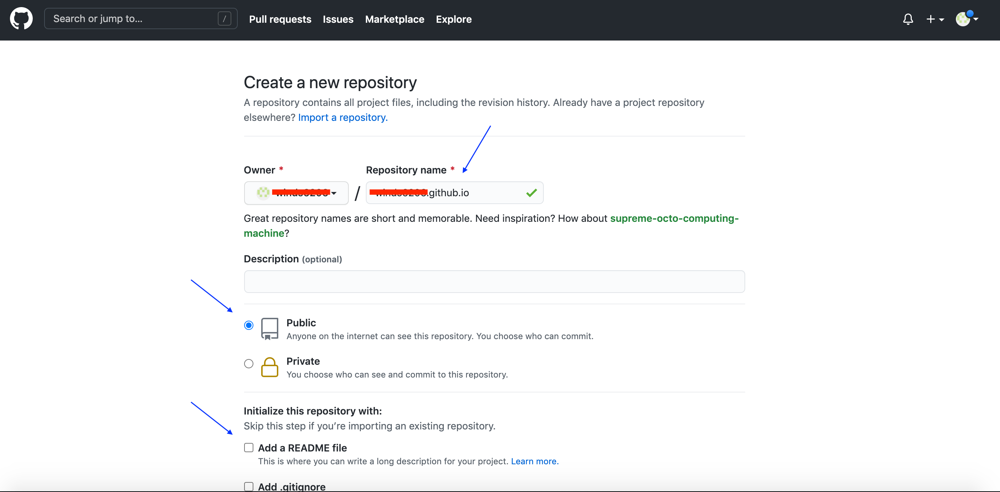

## 前言

當我們開發程式時，一定都會想到 GitHub 或 GiLab 等版控的工具，今天要來介紹一下 GitHub Pages，GitHub Pages 是由 GitHub 所提供的服務，可以讓 Repository 內的靜態檔案，以網頁的方式呈現出來，這代表著 GitHub Pages 提供了 Web Server 的服務，但僅僅支援靜態頁面，如果是後端相關的 code，例如: .php 的副檔名，GitHub Pages 是不會有作用的，所以很多人會使用 GitHub Pages 來架設自己的部落格(Blog)。

<!--more-->

## 如何使用 GitHub Pages

這邊假設大家對於 Git 的使用都已經熟悉了，在依據下面幾個步驟就可以完成 GitHub Pages

- 新增專案(Repository)
- 建立測試檔
- 測試網頁功能

### 新增專案(Repository)

在專案名稱的地方，填寫「`username`.github.io」，這個 `username` 指的是自己的 GitHub 帳號。 並設定為 Public，不建立 README.md 的檔案，後續要新增測試檔案時再自己針對目錄做 Git Initial。

> 要使用 GitHub Pages，Repository 需要設定為 Public



### 建立測試檔

接下來，在本機建立一個目錄並進入

```bash
mkdir username.github.io
cd username.github.io
```

並寫一個測試的首頁 index.html

```bash
echo "Hello World" > index.html
```

初始化目錄並設定 Rmote Repository

```bash
git init
git remote add origin git@github.com:username/username.github.io.git
```

> 上述 username 請填入自己的 GitHub 帳號

提交檔案並推上 GitHub

```bash
git add --all
git commit -m "Initial commit"
git push -u origin master
```

### 測試網頁功能

成功推送後，可以開啟 https://`username`.github.io 試試看，會顯示「Hello World」

> 測試的時候，可以的話盡量開啟無痕視窗來測試，這樣比較不會因為多次修改而造成 cache 的問題

## 參考資料

- https://pages.github.com/
