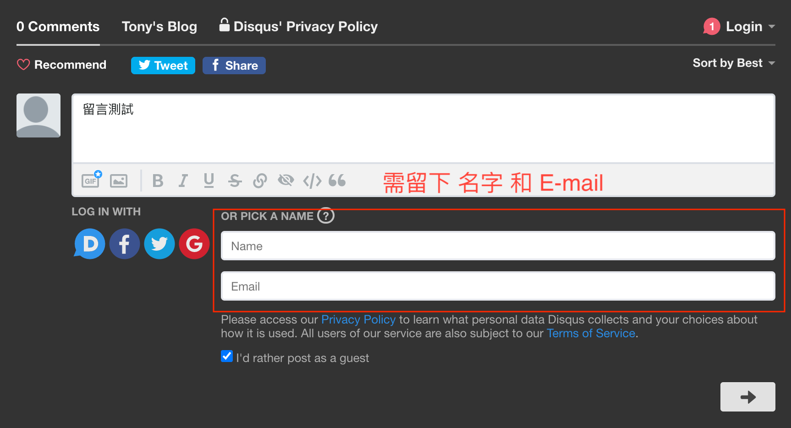

## 前言

當我們利用 Hexo 架設好部落格並選定主題後，我們可能會希望讀者們可以針對文章予以回饋，這時候留言板功能就顯得格外重要，在 Hexo 中我們可以整併 Disqus 留言功能進去，讓文章的結尾可以有一塊專門留言的留言板，好讓讀者能夠留下寶貴的意見或問題

<!--more-->

## Disqus 留言功能的使用

Disqus 留言功能屬於第三方的功能，所以我們需要到 [Disqus 官方](https://disqus.com) 註冊帳號，註冊期間會請你填入 shortname，請留意一下，shortname 設定後是無法再修改的

註冊後再到 `./themes/next/_config.yml` 內 Disqus 的區塊去做設定，將 enable 參數值改成 true，shortname 的值改成 Disqus 當時申請時所填入的 shortname

```yaml
# Disqus
# For more information: https://disqus.com
disqus:
  enable: false
  shortname: YOUR_SHORTNAME
  count: true
```

## 文後討論

因 Disqus 屬於第三方管理，所以相關後台設定需要到 Disqus 登入自己的帳號來調整，例如：留言通知、更改語言等等...

這邊順便提一下，Disqus 預設不允許讀者在沒有登入 Disqus 的情況下進行留言，如果想要讓讀者可以在沒有登入 Disqus 的情況下留言，可以到 Disqus 的後台下述路徑去調整

```text
Settings → Admin → Edit Settings → 選擇要修改的部落格 → Coummunity → Moderation → Guest Commenting打勾
```

> 路徑的部分可能隨時間官方會有所調整，若有更動，可能需要稍微找一下

雖然如此，但是讀者最少還是得留下「名字」跟「E-mail」才能進行留言，如圖

